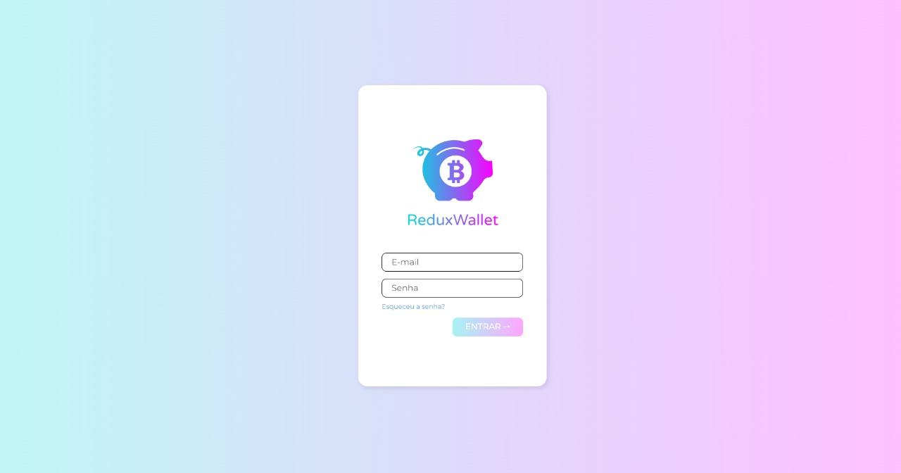

## Wallet Redux

This was a project developed in the [Software Development Course at Trybe](https://www.betrybe.com/formacao-desenvolvimento-web) as a challenge while I was learning how to use Redux. In this project I was able to catch exchange rates from [API de Cotações de Moedas](https://docs.awesomeapi.com.br/api-de-moedas) (Exchange Rate API) and use React and Redux to show our users how much they spent in a certain purchase. The user have access to all their purchases and their respective descriptions, they also have access of the total spent in BRL.

### How to download and run the project code

First of all you need to download the project files, you can do this using git.

```bash
git clone git@github.com:erick-ol/react-trivia.git
```

After you clone the repository you need to enter the folder that contains the project you just downloaded and install all the dependencies of this application.

```bash
npm install
```

Then you just need to start your application to have fun and learn a lot more.

```bash
npm start
```


### Images from the project

